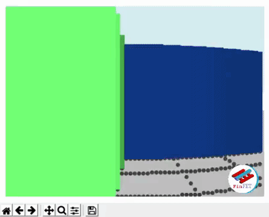

# Ray Casting Python 3D Maze

 
 
Based on the Ray Casting technique, where the objects are drawn entirely out of vertical lines. The size and position of the lines is defined by the distance between the player and the object. This is a very simple 3D maze game made from scratch in python, using only three libraries:

* [Numpy](https://numpy.org/)
* [Matplotlib](https://matplotlib.org/)
* [Keyboard](https://pypi.org/project/keyboard/)


Video tutorial here: https://youtu.be/5xyeWBxmqzc

## Basics

We will begin with a very simple map, later we will make a random map generator. The map is defined by a matrix, where ones represent walls and zeros represent corridors or empty spaces. We also need to set a starting position and direction for the player, as well as the exit coordinates:

<details>
  <summary>Imports, map and initialization:</summary>
 
```python
import numpy as np
from matplotlib import pyplot as plt
import keyboard

mapa = [[1, 1, 1, 1, 1],
        [1, 0, 0, 0, 1],
        [1, 0, 1, 0, 1],
        [1, 0, 0, 0, 1],
        [1, 1, 1, 1, 1]]

posx, posy, rot = 1.5, 1.5, np.pi/4
exitx, exity = 3, 3
```
</details>

Now we can start the vision loop, with a horizontal field of view of 60°, advancing one degree per iteration. The first ray will start 30° to the right of the player and the last one will be at 30° to the left. A ray always starts at the player's position, with increments based on sine and cosine of the ray angle on a infinite loop. A counter is used to keep the distance value the ray has traveled, otherwise one could simply use Pythagoras theorem to calculate the distance at the end.

To test if a ray has hit a wall we just have to check the integer parts of the ray coordinates against the map. If there was a hit we calculate a height and break out of the while loop. after that we draw a vertical line on position i going from -h to h.

<details>
  <summary>Vision loop:</summary>
 
```python
for i in range(60):
    rot_i = rot + np.deg2rad(i-30)
    x, y = posx, posy
    sin, cos = 0.02*np.sin(rot_i), 0.02*np.cos(rot_i)
    n = 0
    
    while 1:
        x, y, n = x + cos, y + sin, n +1
        if mapa[int(x)][int(y)]:
            h = 1/(0.02*n)
            break
        
    plt.vlines(i, -h, h)

plt.show()
```
</details>

After that you should be able to see the middle block surrounded by walls! This is the basic concept of ray casting graphics, now we can turn it into something that resembles a a game. For that we create a game loop which encompasses the vision loop and will also run indefinetly until the game is over. We can make some adjustments to the plotting logic: 

* thicker lines `plt.vlines(i, -h, h, lw = 8)`
* hide axis `plt.axis('off')`
* remove blank spaces `plt.tight_layout()`
* limit plot region  `plt.axis([0, 60, -1, 1])`
* replace `plt.show()`  with `plt.draw()`
* pause and clearing for next frame `plt.pause(0.0001); plt.clf()`
* close the window when the game is over `plt.close()`

For the user input we will use the keyboard library. Basically using the arrow keys we try to move the player to a new location, but this only happens if the new location is not a wall. If the player reached the exit or presses the "esc" key, we break out of the main game loop. This code should be inside the main game loop.

<details>
  <summary>Keyboard inputs and game over:</summary>
 
```python
    key = keyboard.read_key()
    x, y = (posx, posy)

    if key == 'up':
        x, y = (x + 0.3*np.cos(rot), y + 0.3*np.sin(rot))
    elif key == 'down':
        x, y = (x - 0.3*np.cos(rot), y - 0.3*np.sin(rot))
    elif key == 'left':
        rot = rot - np.pi/8
    elif key == 'right':
        rot = rot + np.pi/8
    elif key == 'esc':
        break

    if mapa[int(x)][int(y)] == 0:
        if int(posx) == exitx and int(posy) == exity:
            break
        posx, posy = (x, y)
```
</details>

Now we should have a more or less functional game!

<details>
  <summary>Complete code so far:</summary>
  
  ```python
import numpy as np
from matplotlib import pyplot as plt
import keyboard

mapa = [[1, 1, 1, 1, 1],
        [1, 0, 0, 0, 1],
        [1, 0, 1, 0, 1],
        [1, 0, 0, 0, 1],
        [1, 1, 1, 1, 1]]

posx, posy, rot = 1.5, 1.5, np.pi/4
exitx, exity = 3, 3

while 1:
    for i in range(60):
        rot_i = rot + np.deg2rad(i-30)
        x, y = posx, posy
        sin, cos = 0.02*np.sin(rot_i), 0.02*np.cos(rot_i)
        n = 0
        
        while 1:
            x, y, n = x + cos, y + sin, n +1
            if mapa[int(x)][int(y)]:
                h = 1/(0.02*n)
                break
            
        plt.vlines(i, -h, h, lw=8)

    plt.axis('off'); plt.tight_layout(); plt.axis([0, 60, -1, 1])
    plt.draw(); plt.pause(0.0001); plt.clf()
    
    key = keyboard.read_key()
    x, y = (posx, posy)

    if key == 'up':
        x, y = (x + 0.3*np.cos(rot), y + 0.3*np.sin(rot))
    elif key == 'down':
        x, y = (x - 0.3*np.cos(rot), y - 0.3*np.sin(rot))
    elif key == 'left':
        rot = rot - np.pi/8
    elif key == 'right':
        rot = rot + np.pi/8
    elif key == 'esc':
        break

    if mapa[int(x)][int(y)] == 0:
        if int(posx) == exitx and int(posy) == exity:
            break
        posx, posy = (x, y)

plt.close()
```
  
</details>

Not a fun game, but it is a game. Lets make some improvements.

## Refinements
Firstly, we can add some color to the game. After the map was created, we can go through all its positions and replace the "ones" with random RGB colors or, altenatively, create a secondary matrix to store the colors. These colors are later retrived everytime we hit a wall and used to set the "colors" parameter in the vlines function. We will also add a shading factor based on the distance the ray has traveled, so closer walls are brighter.

We can also add a color for the sky/ceiling and for the floor, this can be as simple as thick horizonal lines drawn before the vertical lines. The last cosmetic i want to discuss are floor tiles: in the same way we calculate heights wen we hit a wall we can do everytime the integer part of one of the coordinates changes, later these points are plotted with the scatterplot function (if they dont appear we can make the floor transparent or set the zorder parameter to 2 or some higher value). These also have the function to sinalize the exit to player with a different color for those tiles.

<details>
  <summary>Code with cosmetic adjustments:</summary>
  
```python
import numpy as np
from matplotlib import pyplot as plt
import keyboard

mapa = [[1, 1, 1, 1, 1],
        [1, 0, 0, 0, 1],
        [1, 0, 1, 0, 1],
        [1, 0, 0, 0, 1],
        [1, 1, 1, 1, 1]]

for i in range(len(mapa)):
    for j in range(len(mapa)):
        if mapa[i][j] == 1:
            mapa[i][j] = list(np.random.uniform(0,1,3))
            
posx, posy, rot = 1.5, 1.5, np.pi/4
exitx, exity = 3, 3

while 1:
    
    plt.hlines(-0.6, 0, 60, colors='gray', lw=165, alpha=0.5)
    plt.hlines(0.6, 0, 60, colors='lightblue', lw=165)
    tilex, tiley, tilec = [], [], []
    for i in range(60):
        rot_i = rot + np.deg2rad(i-30)
        x, y = posx, posy
        sin, cos = 0.02*np.sin(rot_i), 0.02*np.cos(rot_i)
        n = 0
        
        while 1:
            xx, yy = (x, y)
            x, y, n = x + cos, y + sin, n +1

            # tiles logic
            if abs(int(3*xx)-int(3*x)) > 0 or abs(int(3*yy)-int(3*y))>0:
                tilex.append(i)
                tiley.append(-1/(0.02 * n))
                if int(x) == exitx and int(y) == exity:
                    tilec.append('b')
                else:
                    tilec.append('k')

            if mapa[int(x)][int(y)]:
                h = np.clip(1/(0.02 * n), 0, 1)
                c = np.asarray(mapa[int(x)][int(y)])*(0.3 + 0.7 * h)
                break
            
        plt.vlines(i, -h, h, lw=8, colors=c)
        
    plt.scatter(tilex, tiley, c=tilec, zorder=2) # draw tiles on the floor
    plt.axis('off'); plt.tight_layout(); plt.axis([0, 60, -1, 1])
    plt.draw(); plt.pause(0.0001); plt.clf()
    
    key = keyboard.read_key()
    x, y = (posx, posy)

    if key == 'up':
        x, y = (x + 0.3*np.cos(rot), y + 0.3*np.sin(rot))
    elif key == 'down':
        x, y = (x - 0.3*np.cos(rot), y - 0.3*np.sin(rot))
    elif key == 'left':
        rot = rot - np.pi/8
    elif key == 'right':
        rot = rot + np.pi/8
    elif key == 'esc':
        break

    if mapa[int(x)][int(y)] == 0:
        if int(posx) == exitx and int(posy) == exity:
            break
        posx, posy = (x, y)

plt.close()
```

</details>

Some folks asked hot to correct for the fisheye distortion, for that we need to replace `(0.02 * n)` with `(0.02 * n*np.cos(np.deg2rad(i - 30)))` when calculating tiley and h.

Now all you need are some actual mazes to play, you could do this manually or use some kind of maze generator.

## Maze generator
The maze generator I came up with is veri simple:
1. Generate random matrix with ones and zeros
2. Close the walls around the map
3. Make a random walker that starts on one side of the map and goes to the othe side, removing some blocks on the way.
4. This random walker has to have a preference for existing paths, only removing blocks when stuck.
5. When it reaches the othe side the position is marked as the exit

<details>
  <summary>Maze generator:</summary>
  
```python
#random map generator
size = 15
mapa = [[list(np.random.uniform(0, 1, 3))] * size for i in range(size)]
for i in range(size-2):
    for j in range(size-2):
        if np.random.uniform() > 0.33:
            mapa[i+1][j+1] = 0

posx, posy = (1, np.random.randint(1, size -1))
rot = np.pi/4
x, y = (posx, posy)
mapa[x][y] = 0
count = 0 
while True:
    testx, testy = (x, y)
    if np.random.uniform() > 0.5:
        testx = testx + np.random.choice([-1, 1])
    else:
        testy = testy + np.random.choice([-1, 1])
    if testx > 0 and testx < size -1 and testy > 0 and testy < size -1:
        if mapa[testx][testy] == 0 or count > 5:
            count = 0
            x, y = (testx, testy)
            mapa[x][y] = 0
            if x == size-2:
                exitx, exity = (x, y)
                break
        else:
            count = count+1
```

</details>

That's all for the first tutorial, far from a proper game engine, but a fun project nevertheless.

# Ray casting 2.0 - with reflections, better shading, half height walls

Ray casting 2.0 video: https://youtu.be/WhmTa1NGLSE

When I was making the ray tracing version of this game I kept thinking: what if I'm back ported some of those features to the ray casting game? What can we do here?

I too this opportunity and also changed the structure of the code, everything inside functions now, so it is easier to manage.

Let's start with the background, which before was just two horizontal lines, now we will use gradients for added perspective. The gradients are plotted using an array with a linear space (np.linspace) and its brightness changes depending on the angle the player is looking at, inverted for floor and ceiling. I also change the floor tiles for a checkerboard pattern, just changing the rule for when to record the tile points.

<details>
  <summary>Background:</summary>
  
```python
bg = np.linspace(0, 1, 150) #background gradient

...

plt.scatter([30]*150, -bg, c=-bg, s=200000, marker='_', cmap='Greys') #floor
plt.scatter([30]*150, bg, c=bg, s=200000, marker='_', cmap='Blues') #background

...
if int(x*2)%2 == int(y*2)%2: # then record tilex, tiley, tilec

```

</details>

I cannot make shadows like the ray tracing game but I can shade differently each side of the blocks in accordance to the "light" from the skybox. For that I need to know which side of the block a ray has  intersected, which is simply done by probing. Now we have a height map which will be discussed right after.

<details>
  <summary>Shading:</summary>
  
```python
    h = np.clip(1/(0.04 * n*np.cos(np.deg2rad(i-30))), 0, 1)
    c = np.asarray(mapc[int(x)][int(y)])*(0.4 + 0.6 * h)
    if maph[int(x+cos)][int(y-sin)] > 0.5:
        c = 0.85*c
        if maph[int(x-cos)][int(y+sin)] != 0 and sin >0:
            c = 0.7*c
```

</details>

When the ray hits a block with half height it will store its location and color and then keep on until it reaches a block with full height. Ater that we draw the vertical line for the full block, which is farther away, and then we draw the bottom of the half block over it.

<details>
  <summary>Half height blocks:</summary>
  
```python
def caster(x, y, i, ex, ey, maph, mapc, sin, cos, n, half, tx, ty, tc):
    while True: # ray loop
        xx, yy = (x, y)
        x, y = (x + cos, y + sin)
        n = n+1
        if half == None and int(x*2)%2 == int(y*2)%2:#(abs(int(3*xx)-int(3*x)) > 0 or abs(int(3*yy)-int(3*y))>0):
            tx.append(i)
            ty.append(-1/(0.04 * n*np.cos(np.deg2rad(i - 30))))
            if int(x) == ex and int(y) == ey:
                tc.append('b')
            else:
                tc.append('k')
        if maph[int(x)][int(y)] == 1 or (maph[int(x)][int(y)] == 0.5 and half == None):
            h , c = shader(n, maph, mapc, sin, cos, x, y, i)
            if maph[int(x)][int(y)] == 0.5 and half == None:
                half = [h, c, n]
            else:
                break

    return(c, h, x, y, n, half, tx, ty, tc)
```

</details>

Reflections are done in a very simple way,  when a ray hits are reflective block, depending on the side the ray hit we will invert one of the directions of the ray, if it hit a horizontal wall we invert the vertical direction of the ray an the oposite for a vertical wall. To give reflective look to the vertical line we draw it with transparency so the background shines through, and then draw the reflected wall. Things get more complicated when we consider the combinations with half height blocks.

<details>
  <summary>Reflections:</summary>
  
```python
def reflection(x, y, i, ex, ey, maph, mapc, sin, cos, n, c, h, half, tx, ty, tc):
    if half != None:
        plt.vlines(i, 0, h, lw = 8, colors = c, alpha=0.5) #top reflected
        plt.vlines(i, -half[0], 0, lw = 8, colors = half[1])# bottom regular
    else:
        plt.vlines(i, -h, h, lw = 8, colors = c, alpha=0.5) # draw vertical lines
    if maph[int(x+cos)][int(y-sin)] != 0:
        cos = -cos
    else:
        sin = -sin
    c2, h, x, y, n, half2, tx, ty, tc = caster(x, y, i, ex, ey, maph, mapc, sin, cos, n, half, tx, ty, tc)
    c = (c + c2)/2
    if half != None:
        plt.vlines(i, 0, h, lw = 8, colors = c) # draw vertical lines
    else:
        plt.vlines(i, -h, h, lw = 8, colors = c) # draw vertical lines
        if half2 !=  None:
            plt.vlines(i, -half2[0], 0, lw = 8, colors = half2[1])        
    return c, h, x, y, n, half2, tx, ty, tc 
```

</details>


That's all, things start o get heavy for matplotlib, so i also ported everything to pygame (together with the ray tracing game, see files). Anyway, here is the code for matplotlib:

<details>
  <summary>Full code with matplotlib:</summary>
  
```python
import numpy as np
from matplotlib import pyplot as plt
from pynput import keyboard, mouse
from time import time

def main():
    size = 15
    global key; key = None # register keypresses
    listener = keyboard.Listener(on_press=on_press);listener.start()
    last_mouse = [0,0]
    posx, posy, rot = (1, np.random.randint(1, size -1), 1) # player pos
    bg = np.linspace(0, 1, 150) #background gradient
    mapc, maph, mapr, ex, ey = maze_generator(posx, posy, size)# map, exit
    plt.figure(num = 'Pycaster 2.0')
    while True: #main game loop
        start = time()
        rot, last_mouse = rotation(rot, last_mouse)
        plt.scatter([30]*150, -bg, c=-bg, s=200000, marker='_', cmap='Greys')
        plt.scatter([30]*150, bg, c=bg, s=200000, marker='_', cmap='Blues')
        tx, ty, tc = ([], [], [])
        for i in range(60): #vision loop
            rot_i = rot + np.deg2rad(i - 30)
            x, y = (posx, posy)
            sin, cos = (0.04*np.sin(rot_i), 0.04*np.cos(rot_i))
            n, half = 0, None
            c, h, x, y, n, half, tx, ty, tc = caster(x, y, i, ex, ey, maph, mapc, sin, cos, n, half, tx, ty, tc)
            
            if mapr[int(x)][int(y)] == 1:
                c, h, x, y, n, half2, tx, ty, tc = reflection(x, y, i, ex, ey, maph, mapc, sin, cos, n, c, h, half, tx, ty, tc)

            else:
                plt.vlines(i, -h, h, lw = 8, colors = c)
                if half !=  None:
                    plt.vlines(i, -half[0], 0, lw = 8, colors = half[1])
            

            
        plt.axis('off'); plt.tight_layout(); plt.axis([0, 60, -1, 1])
        plt.scatter(tx, ty, c=tc, zorder = 2, alpha=0.5, marker='s') # draw ts on the floor
        plt.text(57, 0.9, str(round(1/(time()-start),1)), c='y')
        plt.draw();plt.pause(0.1); plt.clf()
        # player's movement
        posx, posy, rot, keyout = movement(posx, posy, rot, maph)
        if (int(posx) == ex and int(posy) == ey) or keyout == 'esc':
            break

    plt.close()

def maze_generator(x, y, size):
    mapc = np.random.uniform(0,1, (size,size,3)) 
    mapr = np.random.choice([0, 0, 0, 0, 1], (size,size))
    maph = np.random.choice([0, 0, 0, 0, .5, 1], (size,size))
    maph[0,:], maph[size-1,:], maph[:,0], maph[:,size-1] = (1,1,1,1)

    mapc[x][y], maph[x][y], mapr[x][y] = (0, 0, 0)
    count = 0 
    while 1:
        testx, testy = (x, y)
        if np.random.uniform() > 0.5:
            testx = testx + np.random.choice([-1, 1])
        else:
            testy = testy + np.random.choice([-1, 1])
        if testx > 0 and testx < size -1 and testy > 0 and testy < size -1:
            if maph[testx][testy] == 0 or count > 5:
                count = 0
                x, y = (testx, testy)
                mapc[x][y], maph[x][y], mapr[x][y] = (0, 0, 0)
                if x == size-2:
                    ex, ey = (x, y)
                    break
            else:
                count = count+1
    return np.asarray(mapc), np.asarray(maph), np.asarray(mapr), ex, ey

def rotation(rot, last_mouse): # for 1080p screen
    with mouse.Controller() as check:
        position = check.position
        if position[0] != last_mouse[0] or position[0]>1860 or position[0] < 60:
            delta = last_mouse[0] - position[0]
            if position[0]>1860:
                delta = 1860 - position[0]
            if position[0] < 60:
                delta = 60 - position[0]

            rot = rot + 4*np.pi*(0.5-delta/1920)


    return(rot, position)

def on_press(key_new):
    global key
    key = key_new
    
def movement(posx, posy, rot, maph):
    global key
    x, y = (posx, posy)
    keyout = None
    if key is not None:
        if key == keyboard.Key.up:
            x, y = (x + 0.3*np.cos(rot), y + 0.3*np.sin(rot))
        elif key == keyboard.Key.down:
            x, y = (x - 0.3*np.cos(rot), y - 0.3*np.sin(rot))
        elif key == keyboard.Key.left:
            rot = rot - np.pi/8
        elif key == keyboard.Key.right:
            rot = rot + np.pi/8
        elif key == keyboard.Key.esc:
            keyout = 'esc'
    key = None        
    if maph[int(x)][int(y)] == 0:
        posx, posy = (x, y)
        
    return posx, posy, rot, keyout

def caster(x, y, i, ex, ey, maph, mapc, sin, cos, n, half, tx, ty, tc):
    while True: # ray loop
        xx, yy = (x, y)
        x, y = (x + cos, y + sin)
        n = n+1
        if half == None and int(x*2)%2 == int(y*2)%2:#(abs(int(3*xx)-int(3*x)) > 0 or abs(int(3*yy)-int(3*y))>0):
            tx.append(i)
            ty.append(-1/(0.04 * n*np.cos(np.deg2rad(i - 30))))
            if int(x) == ex and int(y) == ey:
                tc.append('b')
            else:
                tc.append('k')
        if maph[int(x)][int(y)] == 1 or (maph[int(x)][int(y)] == 0.5 and half == None):
            h , c = shader(n, maph, mapc, sin, cos, x, y, i)
            if maph[int(x)][int(y)] == 0.5 and half == None:
                half = [h, c, n]
            else:
                break

    return(c, h, x, y, n, half, tx, ty, tc)

def shader(n, maph, mapc, sin, cos, x, y, i):
    h = np.clip(1/(0.04 * n*np.cos(np.deg2rad(i-30))), 0, 1)
    c = np.asarray(mapc[int(x)][int(y)])*(0.4 + 0.6 * h)
    if maph[int(x+cos)][int(y-sin)] > 0.5:
        c = 0.85*c
        if maph[int(x-cos)][int(y+sin)] != 0 and sin >0:
            c = 0.7*c
    return h, c

def reflection(x, y, i, ex, ey, maph, mapc, sin, cos, n, c, h, half, tx, ty, tc):
    if half != None:
        plt.vlines(i, 0, h, lw = 8, colors = c, alpha=0.5) #top reflected
        plt.vlines(i, -half[0], 0, lw = 8, colors = half[1])# bottom regular
    else:
        plt.vlines(i, -h, h, lw = 8, colors = c, alpha=0.5) # draw vertical lines
    if maph[int(x+cos)][int(y-sin)] != 0:
        cos = -cos
    else:
        sin = -sin
    c2, h, x, y, n, half2, tx, ty, tc = caster(x, y, i, ex, ey, maph, mapc, sin, cos, n, half, tx, ty, tc)
    c = (c + c2)/2
    if half != None:
        plt.vlines(i, 0, h, lw = 8, colors = c) # draw vertical lines
    else:
        plt.vlines(i, -h, h, lw = 8, colors = c) # draw vertical lines
        if half2 !=  None:
            plt.vlines(i, -half2[0], 0, lw = 8, colors = half2[1])        
    return c, h, x, y, n, half2, tx, ty, tc     

if __name__ == '__main__':
    main()

```

</details>

 
 

